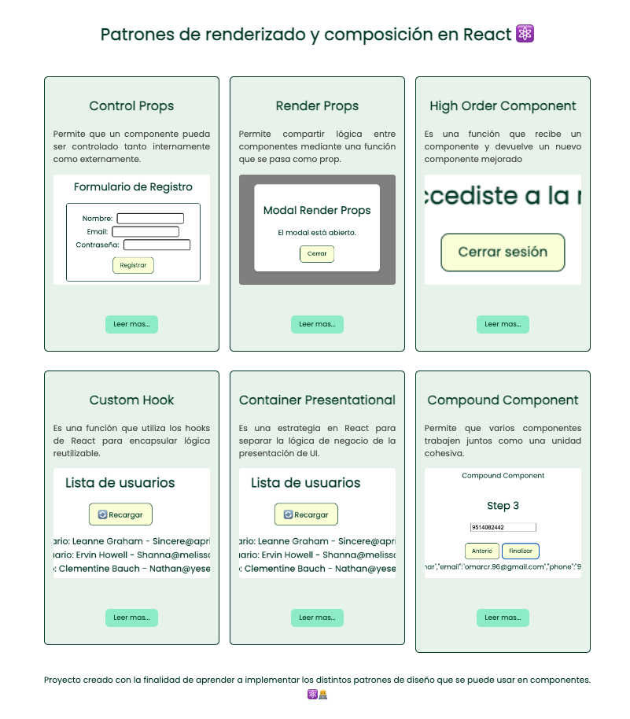
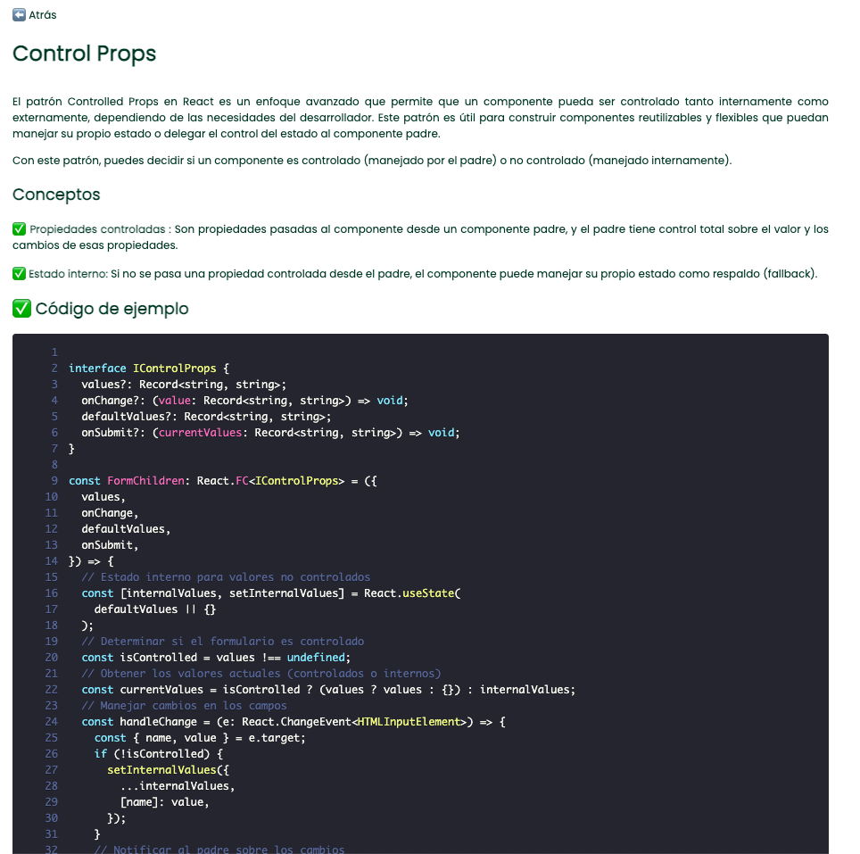
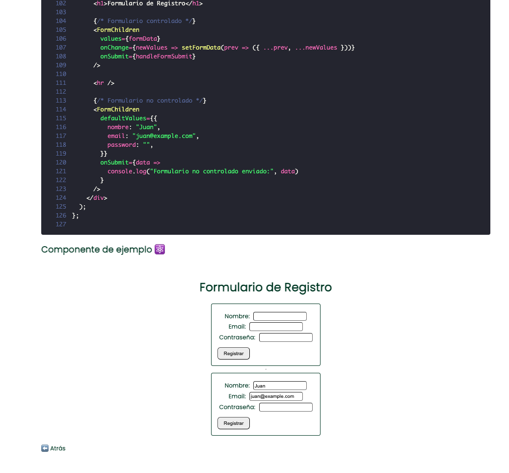

# Patrones de renderizado y composición de React ⚛️

### Proyecto creado con la finalidad de aprender a implementar los distintos patrones de diseño que se puede usar en componentes.

### Ejecución del proyecto ⚛️

1. Clonar el repositorio `git clone https://github.com/omarrendon/desing-patterns-react.git`
2. Acceder a la carpeta del proyecto
3. Instalar dependencias `npm install`
4. Iniciar proyecto `npm run dev`
5. Explorar los diferentes ejemplos
